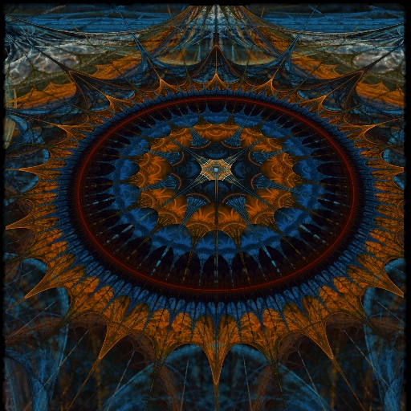

Cuburn, a fractal flame renderer
================================

:Author: Steven Robertson
:Contact: steven@strobe.cc
:Updated: 2011-05-16
:Tags: CUDA, Algorithm, Article

A GPU version of the fractal flame algorithm is an incredibly tough nut to
crack. While the core of the algorithm – an iterated function system which
traces the trajectory of a point throughout a chaotic attractor – is an
embarrassingly parallel problem, several aspects of the full flame
algorithm require behavior which is quite literally the worst case for
performance on GPUs. Solving these problems directly has required some
interesting hacks; for some details, see this paper_ (ripped from a school
report, so pardon the references and overly puffy formal language).

I've coded_ up some of those hacks in the space between the end of the
semester and the start of my internship; there are still more image-quality
and performance  improvements to be made, but it gets ~500x the performance
of the CPU version, which is quite satisfying for a week of work. Here's an
example image (click for full):

.. _paper: sd-report.pdf
.. _coded: https://bitbucket.org/srobertson/cuburn

I'm also working on a more elegant implementation, using functional
programming and strong static typing to solve many of the debugging and
maintainability challenges involved in writing tightly-optimized code.
Although there are several fully-functional versions of an embedded DSL
which would enable this style of GPU programming, both using Haskell and
Python as base languages, none have been good enough to see the light of
day. I intend to keep working on it, though.

