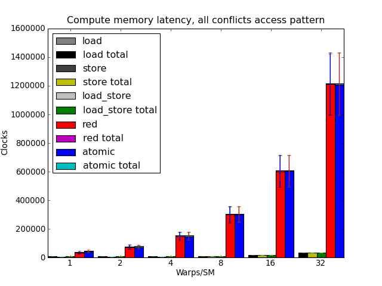

CUDA atomics: a practical analysis
==================================

:Author: Steven Robertson
:Contact: steven@strobe.cc
:Published: 2009-11-12
:Updated: 2009-12-30
:Tags: CUDA, Algorithm, Article
:Abstract:
    NVIDIA has been coy with details about how they implement certain
    features, but the right benchmarks can help uncover their approach,
    helping developers write better code the first time.

.. Contents::

NVIDIA's chips can have huge numbers of threads in-flight at a time; on my GTX
275, nearly 30,000 threads can be in the midst of executing. There is limited
thread synchronization between threads on the same processor, and no
inherent synchronization between other processors. Any coordination
between threads must be achieved by writing to global memory, an activity
with a large latency penalty.

As such, the atomic operations in the CUDA ISA are critical to some
algorithms. In typical fashion, NVIDIA provides little guidance as to the
performance of these operations, or as to the manner in which they are
implemented. On a traditional CPU with a reasonable number of cores, one might
simply suggest a few benchmarks, and indeed some benchmarks have been done on
GPUs. The issue is that those benchmarks reveal that, for an operation as
simple as an addition of a single variable, performance of atomic operations
can be thousands of times slower than a traditional read-modify-write cycle.
Under the right circumstances, they can also perform *faster* than non-atomic
instructions.

For those crafting algorithms which use a number of atomic operations,
understanding what causes the enormous difference in performance operations
makes it easier to create optimized implementations. Along with a few others,
I'm working on `one such algorithm`_. This article will attempt to use
benchmarks to help uncover the architecture used for memory operations in
CUDA, in order to make writing such algorithms less of a trial and error
affair.

.. _one such algorithm: /do_androids_render/

I'm aiming to build an understanding of the architecture by asking a testable
question, benchmarking, crafting a testable hypothesis as to why the results
are the way they are, and then repeating the cycle until we're out of
surprises. It's possible that this will lead to bad predictions (in fact, it
already has); for the sake of conciseness, I'll edit the incorrect conclusions
out (and possibly place them in a scrap-heap article so that everyone who
wishes to can still mock me for being so very wrong) rather than describe my
backtracking.

Hardware and assumptions
------------------------

These benchmarks are being done on an NVIDIA GTX 275 GPU, running at standard
clocks, plugged into a Intel G965 motherboard, driven by a Core 2 Duo 6400
with 6GB RAM. The fact that my motherboard only supports PCIe 1.0 shouldn't
cause a difference with any of these benchmarks, as they exclude any
host-to-device latencies.

My understanding of NVIDIA's GT200 architecture comes largely from `NVIDIA's
own documentation`_ and the analyses done by `Real World Tech`_ and Beyond3D_.
I suggest the latter two if you're not familiar with the architecture.

.. _NVIDIA's own documentation: http://developer.nvidia.com/page/home.html
.. _Beyond3D: http://www.beyond3d.com/content/reviews/51
.. _Real World Tech:
    http://www.realworldtech.com/page.cfm?ArticleID=RWT090808195242

It should also be noted that my background is in audio and video, *not* in 3D,
so this will be focused exclusively on general-purpose computation. While
certain tricks may exist that use dedicated hardware for better performance,
if you can't do it from CUDA, I don't consider it here. That might be a stupid
move, but we'll see.

These benchmarks are being conducted using PyCUDA_, with data processing
handled by numpy and scipy. They're all written in PTX, NVIDIA's own assembly
language\ [#]_. Output is rendered by matplotlib_.  The source (*caution:
ugly*) is available here_.

.. _PyCUDA: http://mathema.tician.de/software/pycuda
.. _matplotlib: http://matplotlib.sourceforge.net/index.html
.. _here: ptx.py

.. [#]  PTX is a rather nice assembly language, and in some ways is still
        rather high-level. After trying both CUDA and PTX, I find that PTX
        allows me to write optimized code more easily, and involves fewer
        guesses about what's going on than CUDA's C compiler.

Precision and accuracy
----------------------

Oh, and before we get started: you should probably know that `my last
attempt`_ contained flagrantly incorrect results. So maybe don't trust these
so much until the article is done, okay?

.. _my last attempt: /articles/cuda_atomics_FAIL/

For the curious, or those prone to schadenfreude: the benchmarks previously
presented here were entirely correct; they accurately reported the number of
clocks it took to run the given kernel. They seemed exceptionally strange, and
they were—how many architectures do you know of where an atomic operation
beats an unsynchronized one?—but I verified all the data being written by the
kernels, ran the tests dozens of times, reread the statistics and graph code
to make sure that everything was right. It all checked out. In fact, it
checked out exceptionally well; most runs ended up with averages that stayed
within one cycle of each other, and several would produce exactly identical
results across each warp in each SM.

I figured that with so much consistency on my side, I had to be right. I even
came up with an explanation which was consistent with all public information
about the chip, one that seemed to satisfy myself and others working on the
same project. Sure, the numbers implied a sustained write performance of 7
TB/s to global memory, but that's not unreasonable for a large, wide cache.

Ultimately, I uncovered my error when testing my explanation. The test kernel
used a single 32-thread warp to probe memory locations in a pattern designed
to uncover the total cache size and cache line size of the supposed writeback
cache. The results were fantastical, absurd; either NVIDIA hid more than a
billion extra transistors on the die for a 32 MB SRAM cache, or something was
wrong with my technique.

I had fallen into a trap which has ensnared scientists and engineers for
centuries: assuming that `accuracy meant precision`_. When an
experiment contains a systematic error, sometimes the data is kind enough to
be inexplicable, at which point most rational people will go back and recheck
their experimental design. Unfortunately, humans are *very good at explaining
things.* Given data which is remarkably consistent, we excel at conjuring a
mechanism which explains it.

.. _accuracy meant precision:
    http://en.wikipedia.org/wiki/Accuracy_and_precision

I suppose the moral of this story is that you should never use a black box to explain the behavior of a system unless you can set up an experiment to isolate and characterize the black box directly\ [#]_.

.. [#] It is a very *particular* moral.

As for the bug, it was pretty trivial: I was repeating a short benchmark many times, and I assumed that the precision of the results indicated that they were an accurate representation of longer kernels. I also did not depend on the return value of the atomic operations. The out-of-order capabilities of the compiler and/or chip were allowing all timing code to execute before any results were returned. The rest of the article will take this into account, and (upon completion) will also explore these capabilities directly.

What does clocks() return?
--------------------------

This one has nothing to do with atomics, but a good understanding is necessary for benchmarking. It seems like it could be a stupid question, as the documentation says it quite clearly:

    "When executed in device code, returns the value of a per-multiprocessor
    counter that is incremented every clock cycle."

Okay, neat. Except, wait, *which* clock? One would assume that this refers to the frontend clock, which ticks twice for each warp, but does that leave the two half-warps with different clocks? Or does it refer to the clock on the backend, which ticks four times per warp, leaving us with up to four different values per warp?

The heart of this experiment is in these three lines:

.. code:: text
    :nolinenos:

        mov.u32     clka,   %clock;
        mov.u32     clkb,   %clock;
        sub.u32     clka,   clka,   clkb;

Register 'clka' ends up holding the difference between two samples of the clock. Running the kernel in a single thread per SM and dumping the results to memory, we get to see this value. Turns out it's *exactly* 28 clocks, without deviation.

Running it at 32 threads per SM, the results stay steady at 28 clocks, and all results in a warp are equal, indicating that this is the frontend clock latched at the start of a two-clock warp. Setting up a tight 256-round loop and storing the sum of differences to memory, we find this result:


The uncanny exactness of 28 clocks per round disappears when you have more
than more than 2 warps per SM. This makes a lot of sense; at 4 warps, with two
cycles per warp instruction and two instructions per clock, a round-robin
scheduler would take 32 cycles to come back to the first warp, giving enough
room to hide whatever caused the 28-clock minimum latency. Adding a few
instructions in between those operations suggests that each SM is pipelined to
give that massive register file time to breathe (obvious), that the exactness
of the 28 clocks may be related to accessing special registers like %clock
(less obvious), and that register dependencies are caught and handled by the
instruction scheduler (obvious in hindsight).

The tightness of the error bars, even as the card climbs past full occupancy,
is misleading, as this is the mean of 256 runs per thread. Cutting down the
number of runs per thread to 8 shows much less determinism in saturated SM
scheduling, although it's comforting to note that the algorithm in use tends
to keep threads at approximately the same instruction count (in the absence of
memory operations) without the explicit use of thread synchronization over
longer runs.

.. image:: consecutive_clocks_8_iter.png

*Conclusion:* clocks() returns the frontend clock at the start of a warp's execution. On an underutilized SM which can't hide instruction latency, the comparison adds 28 cycles of latency on top of whatever was between the calls; this drops to 2 cycles on a fully utilized SM. It should be safe to use clocks() for benchmarking.

How long does an atomic operation stall a thread?
-------------------------------------------------

Benchmark
`````````

For this question, we'll consider five types of operations: 'load' and
'store', neither of which is sufficient to compare to an atomic operation like
'add' but are included for reference; 'load_store', the traditional
read-modify-write approach to addition; 'red', which performs an atomic
reduction—that is, it computes and stores to global memory, but does not use
the value returned from the memory controller in subsequent operations\ [#]_;
and 'atomic', which explicitly uses the result.

.. [#]  In C/C++, the compiler should emit a 'red' automatically when you
        ignore the return value of AtomicAdd() and friends.

These global memory operations will be run in a tight loop with code that times each operation. For 'load', 'load_store', and 'atomic', an explicit register dependency is created on the return value of the global memory operation by xor'ing it with 'clka' in the example above before reading in 'clkb'. This trick seems to prevent an SM from reordering the clock sampling to improve accuracy. It does *not* affect 'store' or 'red' operations, so the reported numbers there may be incorrect or at least misrepresentative. More on this later.

Three memory access patterns will be tested. The first goes straight for the jugular: all writes across an SM go to the same address, ensuring that all atomic operations cause a conflict. Each SM gets its own address, though, because having all processors write to the same location caused several system crashes during testing. This is expected to be nearly the worst case for atomic operations, and the results do not disappoint:


Ick. Let's not do that again.

The next access pattern is less pessimal; each memory location is separated by 128 bytes, and each thread gets its own memory location, ensuring that no conflicts occur but also preventing the chip from coalescing any memory operations.


Well, that's... tolerable. It remains to be seen whether atomics can be used for scatters in computation threads, but this looks like it wouldn't cause too much damage. One last access pattern: this time, all threads are neatly coalesced, each accessing a 4-byte memory location in order, such that a warp hits a single 256-byte-wide, 256-byte-aligned region of memory.


Crap. That's quite a bit worse. Sure, the total latency for an atomic operation is better, but the ratio between an uncoalesced atomic and read-modify-write latency is much smaller than that for the coalesced pattern, so the *relative* cost of atomic operations in this context is much worse.

Analysis
````````

Take a look at the error bars in the above graphs. For the 'all conflicts' access pattern, there's an enormous variability in the time it takes to serve requests; whatever mechanism is being used to deal with conflicting atomic operations isn't capable of FIFO scheduling all of them. In the 'uncoalesced' access pattern, the error bars shrink substantially; the variability of the times it takes to issue the memory request is very low. Coalesced memory accesses also have very steady times for both the load and load-store operations, but have a higher variance for store, atomic, and reduction operations. Note also that coalesced reductions, which should in theory allow the scheduler more freedom to hide memory latency, take longer and have more variance than atomics which prevent a kernel from processing the next instruction.

To explain this behavior, we need a detailed model of the memory architecture
of the chip. From the descriptions at `Real World Tech`_ and Beyond3D_, along
with a little inference and a few patent searches, we have some *a priori*
knowledge. Stream Multiprocessors have independent computation hardware,
register files, and shared memory, but they're not entirely independent. Each
SM is bundled with two others into a Thread Processing Cluster, which handles
instruction fetch, scheduling, and dispatch, as well as global memory
operations (including ROP and texture fetch). The TPC's controlling logic
(*frontend*) is in a different clock domain from the ALU, FPU, and SFU
(*backend*), with the former at half the speed of the latter. The TPC is also
connected to a crossbar bus that connects to the other TPCs and the memory
controller, among other things.

`US Patent Application 12/327,626`_ vaguely describes a GPU memory controller.
Given the filing date and subject matter, it probably covers technology
developed for Fermi, but Fermi and GT200 are not so dissimilar as to make the
filing irrelevant. It states,

.. _US Patent Application 12/327,626:
    http://www.google.com/patents/about?id=IQS_AAAAEBAJ

    "In one embodiment, memory hub bus 240 is a high-speed bus, such as a bus
    communicating data and memory requests in data packets (a "packetized"
    bus). For example, high-speed I/O buses may be implemented using a low
    voltage differential signal technique and interface logic to support a
    packet protocol to transmit and receive data as data packets."

By indulging in some speculation, it is easy to envision a vague protocol for
issuing memory transactions on this bus. For the sake of having something to
test, even if it is later found incorrect, let us assume that each TPC has a
finite queue for pending memory operations, and that the memory controller
also has such a queue. A TPC issuing a memory transaction would queue it, mark
some registers as dirty on the scoreboard_, and post the request on the bus.
Then—and this part is entirely speculation, as other mechanisms for doing QoS
or rate-limiting are widely employed in buses like PCI-E and
HyperTransport—the TPC waits for an acknowledgment from the memory controller
indicating that the memory request was successfully queued. In the event that
the memory controller's queue is full, the controller would bounce a "retry
later" message to the TPC. All of this is done over the packet-oriented bus
described above. Atomic calculations are handled by a dedicated SIMD ALU on or
near the memory controller.

.. _scoreboard: http://www.google.com/patents/about?id=vDiuAAAAEBAJ

This mechanism will be tested and refined as we go, but for now it does manage
to account for a few of the curiosities in the first round of benchmark
results. If we assume the proposed system is true, then:

* The small but nonzero wait time of "set-and-forget" operations such as
  'store' and 'red' under low-utilization conditions is the round-trip time to
  the controller. (When the controller's not flooded, a 'red' performs more or
  less just as fast as a 'store', as we'll see later.)

* The increasing wait time and variance of 'store' and 'red' as compared to
  their typically-slower analogs 'load' and 'atomic', respectively, under
  conditions when the controller was starved for DRAM bandwidth—viz,
  coalesced, 32 warps/SM—are related to increased numbers of memory controller
  "retry later" rejection messages. In other words, the limited TPC memory
  transaction queue is filled by 'load' or 'atomic' instructions waiting to
  return, acting as an implicit rate-control, whereas the TPCs simply retry
  continuously when attempting to push a 'store' or 'red' at the GPU, and the
  loop of rejection packets floods the *internal bus bandwidth* (or packet
  rate limit) as well as the DRAM bandwidth, causing the slight penalty seen
  in those instructions on the latter benchmark.

* The limiting factor causing the decrease in the ratio 'load_store'/'atomic'
  in the coalesced case is the memory controller's ALU.

However, the explanation is not perfect, or at least not complete; it doesn't
seem to explain why uncoalesced operations have such a tight variance, nor
does it answer any questions about how conflicts are handled. It also doesn't
include hard numbers, such as the width of the SIMD ALU at the memory
controller or the depth of the transaction queues. But there are plenty of
benchmarks left to run which could help clear up these matters.

Memory access patterns with delays between accesses
---------------------------------------------------

Benchmark
`````````

The same three benchmarks as above, but with 50 32-bit multiply-adds thrown in. Remember, on GT200, a multiply-add is implemented as four separate instructions, so this is actually 200 instructions or 400 front-end cycles of computation added in addition to the memory operation and loop construct.



Yes, atomic collisions suck. But we knew that.


Note the performance of memory operations when the memory core is underutilized. Promising.


That's right: free atomics.

Analysis
````````

If you have the luxury of using coalesced memory operations, the performance
cost of atomic operations which use the result are essentially identical to
that of a read-modify-write cycle. The performance cost of a coalesced 'red'
operation actually *beats* 'load_store' handily. If your kernel has enough
number-crunching instructions between memory accesses, then the performance
difference between any of these is insignificant, as long as the memory
controller is not flooded\ [#]_.

.. [#] Coalescing uses the memory controller more efficiently, so it reduces
    the load, but the same effect can be achieved for uncoalesced memory
    writes if your kernels perform more computations between writes, as we'll
    see in later benchmarks.

The particular conditions determining when atomic operations are "free" depend
on a number of factors, including kernel length, SM occupancy, register
dependencies, and memory access patterns. For example, the test kernel's
'filler' instructions all depend on the result of the previous instruction, so
it takes an occupancy of 8 warps/SM to hide register file latency and fully
utilize the ALU. A different kernel might be able to swap threads more
frequently, meaning that 1/8 occupancy might fully load the ALU. Of course,
such a kernel might also issue more memory transactions as a result of its
faster rate of execution, which could lead to the bandwidth constraints that
result in higher penalties for memory operations. In other words, if you
absolutely need atomics to be "free", benchmark your particular code!

On the other hand, these results also show that it's not hard to get free or at least cheap atomics. I had prepared a complex workaround for the flame algorithm to avoid using these "slow" operations, and the flam4_
implementation just gives the finger to atomicity and doesn't attempt to avoid collisions (granted, they shouldn't be *that* common, but still). Both of these tradeoffs were intended to avoid the high perceived cost of atomic operations; neither, as it turns out, were necessary.

.. _flam4: http://sourceforge.net/projects/flam4/

These results are consistent with the proposed model for operation of the
memory controller, but do not provide significant refinements to that model.
The delays in the uncoalesced access pattern provides a bit more support for
the theory that atomic operations are handled on-chip by a SIMD ALU;
presumably, the flood of single-location uncoalesced memory requests were
causing the ALU to be saturated with 1-vector operations.

Do adjacent memory operations cause atomic collisions?
------------------------------------------------------

Benchmark
`````````

Each CTA is given its own 32K region of global memory. The first eight lanes
of each warp in a 32×8 CTA choose a memory address, so that each is offset
from a 4K boundary by the distance under test. The result is that each warp
places 8 memory accesses per iteration, each exactly 4K apart, and each offset
from a 4K boundary by the same distance per *warp*, but a linearly varying
distance across the CTA. It's easier to understand with an equation::

    address = 32768*ctaid.x + 4096*ctaid.x + OFFSET*ctaid.y;

Note that 'x' and 'y' are in the opposite order from what you might expect, to
prevent memory accesses from being coalesced. A concern with this method is
the potential to exhaust the number of queued memory operations per local TPC
scheduler; this motivated the choice to limit to 8 memory operations per warp,
which may help to avoid that condition, but will be investigated again after
the queue depth tests.

We expect to see a penalty for atomic operations with a very high peak at low
offsets, which drops off sharply to draw nearly even with a load/store
operation at higher offsets. We are not disappointed:


Analysis
````````

CUDA is geared towards parallel computation, and the memory architecture
benefits from coalescing memory operations. Given the bias towards
implementing memory operations with large widths, regardless of the actual
amount of data requested, it seems likely that the mechanism which prevents
atomic transactions from interfering with each other also operates on
something more than a byte at a time. This, really, is the ultimate purpose of
asking this question; it can be imagined that if you're relying on atomic
scatters to make your algorithm feasible, you're not likely to implement a
complicated mechanism for preventing adjacent writes, so the information
gathered here is simply being used to test and expand the model for GT200b's
operation.

Unfortunately, the data isn't as much of a slam dunk as would be desired for
further asserting the nature of the underlying architecture. The chip was
running a 30-block grid, which should allocate one 256-thread warp per SM, and
yet the lowest time to complete an iteration is much higher for this benchmark
than for previous benchmarks at this occupancy. Perhaps this discrepancy will
be explained by later benchmarks, but for now have caution in interpreting
these results.

While the scale may be different than what was expected, however, the
*relative* sizes of the results are right in line with expectations. This
benchmark is somewhat more probabilistic in nature than the previous
benchmarks: not only is the thread execution order nondeterministic (as far as
we know), the results of a collision can only be seen when that collision
actually happens, which requires both memory transactions to be in the
collision detection mechanism at the same time. For the all-conflicts case,
assuming that both the memory controller and TPC have queues of sufficient
depth to dispatch more than one warp's worth of transactions at a time (8
transactions, in this case), a collision should happen for every thread
iteration; as this is a deterministic result, we can arrive at conclusions by
comparing the other results with the 0-byte offset case.

The results for a 4-byte offset are clearly very similar to those obtained for
a 0-byte offset. With 8 different warps each writing 4 bytes of data with a
4-byte offset, every write happens within a 32-byte range per lane. Since the
results are so closely to the collision-guaranteed 0-byte case, the data
suggests that atomic writes within 32 bytes of one another are considered
conflicting by the memory controller; in other words, we can say with
confidence that the atomic lock width is at least 32 bytes.

At 8 bytes, corresponding to a 64-byte region of memory per lane, a run takes
about 80% of the time per iteration as the baseline. Barring DDR shenanigans,
we can chalk this improvement up to consecutive atomic operations that do not
result in collisions. The mere presence of an improvement alone is compelling
evidence which points to an atomic lock size of exactly 32 bytes, as a larger
lock would have given the same performance for an 8-byte offset as for a
4-byte one. The trend continues, with a 16-byte offset having an even lower
performance penalty, and the 32-byte offset having no significant performance
penalty. As a whole, the evidence is strong for a 32-byte lock width.

An interesting and unexpected result came up when running this benchmark with
more than one warp per SM. Take a look:


The performance boost at 64 bytes, and the further improvement at 128 bytes,
points toward an increase in memory bandwidth when transactions are spread out
past a certain width. Curiously, the 256-byte offsets and above aren't quite
as fast as the 128-byte case, although they're certainly faster than the
32-byte offsets. (Again, these numbers refer to the offsets only; all of the
actual write widths are 4 bytes.) These figures are probably due to the effect
of the memory itself shining through the memory controller. They may be
related to the way bank interleaving is done on the card, or to latency
penalties for certain addressing operations. I'd have to study DDR's operation
a little more to draw conclusions from these results.

The first hints of the manner in which memory operations are scheduled and
retired are also visible in these results, and once a few experiments are run
which target the TPC and memory controller queue depths explicitly we can come
back and validate these results, but the probabilistic nature of these results
(along with the lack of nice assumptions like purely-random scheduling) makes
extracting that kind of information a bit of a stretch, so I'm also setting
that one aside for later.

To be continued...
------------------

This article is split into multiple parts, some of which have yet to be
written. Questions that I'm working on answering include:

* How many instructions are needed to hide atomic latency?

* Does an atomic collision interfere with non-colliding transactions?

* What's the width of the memory controller SIMD ALU?

* What is the depth of the transaction queue on a TPC? On the memory
  controller?

* Does the hardware do any kind of out-of-order execution? If so, what?

* Can instruction reordering by the programmer result in significant speedups?

Acknowledgments
---------------

My thanks go out to `Sylvain Collange`_ and Christian Buchner for valuable
feedback and pointers at `the CUDA forums`_.


.. _Sylvain Collange: http://gpgpu.univ-perp.fr/index.php/Barra
.. _the CUDA forums: http://forums.nvidia.com/index.php?showtopic=150856
